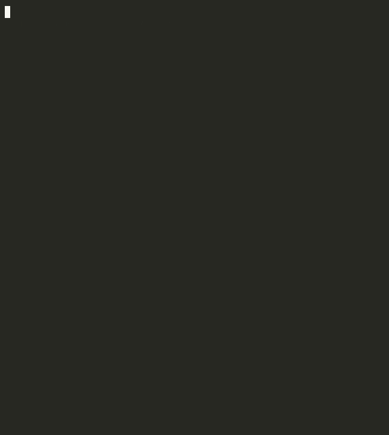

<div align="center">

# redact

**PII redaction that shows its work.**

[](https://www.python.org/)
[](LICENSE)
[](https://github.com/aminwa/redact/actions/workflows/ci.yml)
[](#)

*NER model · LLM · side-by-side comparison · pipe-friendly*

</div>

---



---


## What it does

redact strips PII from text using two engines in parallel - a spaCy NER model and Claude - then lets you compare what each one caught.

| Engine | How it works |
|--------|-------------|
| **NER** | spaCy transformer model + regex rules for email, phone, SSN, card numbers |
| **LLM** | Claude extracts PII with character-level offsets, handles context the model misses |
| **Both** | Union of both engines, overlapping spans deduplicated |

---

## Install

```bash
git clone https://github.com/aminwa/redact.git
cd redact
bash install.sh
```

Or manually:

```bash
pip install -e .
python -m spacy download en_core_web_sm
```

Set your API key for LLM mode:

```bash
export ANTHROPIC_API_KEY=sk-ant-...
```

---

## Quick start

```bash
# redact a file
redact report.txt

# pipe from stdin
cat document.txt | redact

# write to file
redact report.txt -o clean.txt

# block style instead of labels
redact report.txt --style block

# NER only (no API key needed)
redact report.txt --mode ner

# LLM only
redact report.txt --mode llm

# see what would be redacted
redact scan report.txt

# compare NER vs LLM side by side
redact compare report.txt
```

---

## Detection

| Type | Engine | Example |
|------|--------|---------|
| `PERSON` | NER + LLM | `Alice Martin` |
| `EMAIL` | regex + LLM | `alice@example.com` |
| `PHONE` | regex + LLM | `+44 7700 900123` |
| `ORG` | NER + LLM | `Acme Corp` |
| `LOCATION` | NER + LLM | `Paris, France` |
| `SSN` | regex + LLM | `123-45-6789` |
| `CARD` | regex + LLM | `4111 1111 1111 1111` |
| `DATE` | NER + LLM | `12 March 1990` |

---

## How it works

```
input text
    │
    ├──► spaCy NER ──► named entities
    │        └──► regex rules ──► email / phone / SSN / card
    │
    └──► Claude ──► JSON entity spans
    │
    ▼
 dedup + merge overlapping spans
    │
    ▼
 redacted output
```

The `compare` command shows the gap between the two engines, useful for understanding where each approach fails and why.

---

## Project structure

```
redact/
├── core/
│   ├── entities.py   entity types and dataclass
│   ├── ner.py        spaCy + regex engine
│   ├── llm.py        Claude extraction engine
│   └── pipeline.py   merge, dedup, redact, compare
└── cli/
    └── main.py       typer CLI: run / scan / compare
```

---

## Running tests

```bash
pip install -e ".[dev]"
pytest tests/ -v
```

LLM tests run with mocked API calls, no key required.

---

## License

MIT © AW Labs
